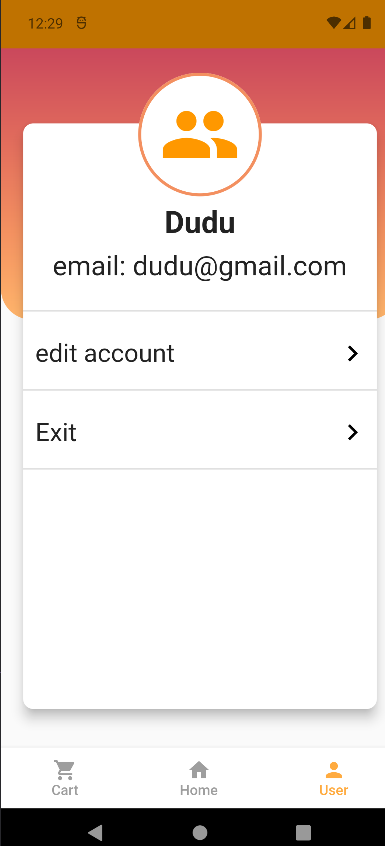

# ecomerce

Um projeto para treinamento de E-comerce.
construído com a poderosa plataforma Flutter.

Para garantir uma base sólida e eficiente, integrei o Firebase,uma plataforma de desenvolvimento de 
aplicativos móveis do Google, que permite lidar com recursos essenciais, como autenticação de usuários.

Além disso, incorporei o Sqflite, uma biblioteca de banco de dados local em SQLite para Flutter. 
Isso nos permite armazenar e gerenciar dados de forma eficiente no dispositivo do usuário, 
garantindo um acesso rápido às informações essenciais do aplicativo, mesmo em modo offline.

No que diz respeito à gestão de estado, utilizei as bibliotecas MobX e Provider. 
O MobX é uma solução de gerenciamento de estado reativa, que nos permite atualizar 
a interface do aplicativo de forma eficiente sempre que ocorrerem mudanças nos dados. 
O Provider, por sua vez, facilita a injeção de dependências e o compartilhamento de 
informações em toda a estrutura do aplicativo.

Com uma interface intuitiva e atrativa, usuários poderão navegar facilmente por diferentes
categorias de produtos, realizar pesquisas e adicionar itens ao carrinho

